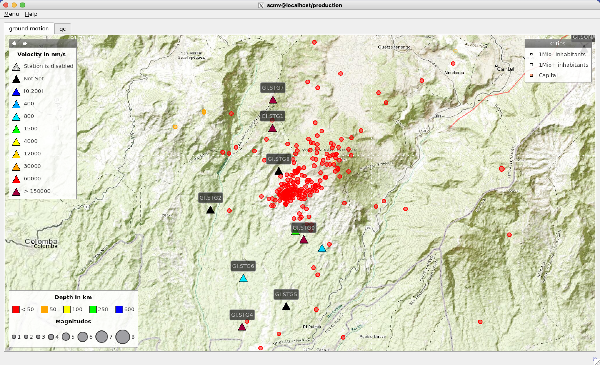

# Background maps for SeisComP GUIs customised to Santiaguito volcano

1. Get the maps:
   ```bash
   git clone https://github.com/VolcSAT/Maps-for-SeisComP.git ~/.seiscomp/Maps-for-SeisComP
   ```
2. Setup SeisComP to use the custom maps:
   ```bash
   cat ~/.seiscomp/Maps-for-SeisComP/global.cfg >> ~/.seiscomp/global.cfg
   ln -s ~/.seiscomp/Maps-for-SeisComP/bna ~/.seiscomp/bna
   ```
3. Start a SeisComP GUI with maps in *debug* mode and report issues, e.g.:
   ```bash
   scmv --debug
   ``` 

